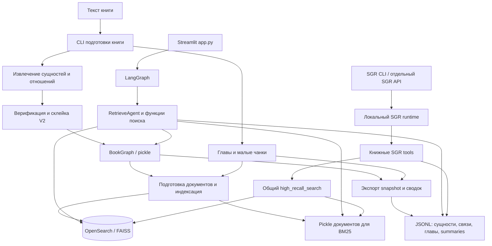
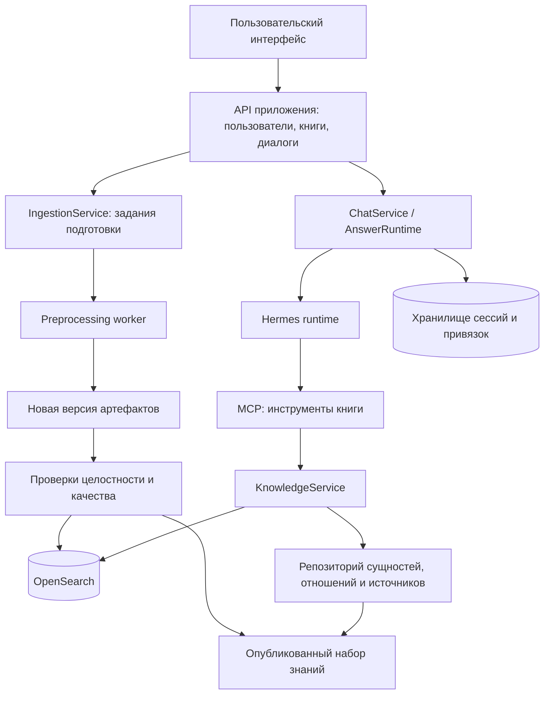

# Архитектурный разбор проекта и переход отвечающей части на Hermes

Дата анализа: 20 сентября 2026 года.

Объект анализа — текущая рабочая папка, преимущественно `scenatio_helper`. Написание имени каталога сохранено. Документ описывает файлы на диске, включая незакоммиченные изменения; это не описание только последнего коммита `4c7cd56`.

Под **Hermes harness** далее понимается **Hermes Agent от Nous Research**. Это рабочее предположение о выбранном продукте. Сведения о его интеграциях сверены с официальной документацией на дату анализа; конкретную версию нужно закрепить при реализации.

## 1. Главный вывод

Проект уже содержит существенную предметную разработку: подготовку книги, извлечение сущностей и отношений, склейку сущностей, проверку графа, экспорт snapshot, гибридный поиск и инструменты получения контекста. Это полезная основа, которую следует сохранить при смене отвечающего агента.

Главная архитектурная проблема — отсутствие единой границы между данными книги, поисковой логикой и средой исполнения агента. Несколько способов ответа используют разные представления знаний и настройки, а согласованность этих представлений не обеспечивается общей версией публикации.

**Рекомендуемая цель:** сохранить подготовку данных отдельным процессом; выделить независимый `KnowledgeService`; предоставить его инструменты Hermes через MCP; пользовательский API отделить от конкретного harness. Hermes отвечает за диалог и выбор действий, предметный сервис — за поиск, идентификацию сущностей, источники и ограничения выдачи.

Перед миграцией необходимо исправить несколько дефектов данных и проверки качества. Иначе новый harness будет получать неполный контекст, а сравнение ответов может показывать недостоверные результаты. Сам переход на Hermes не исправит потерянные отношения, неоднозначные имена и ошибки индексации.

## 2. Что проверено и где проходят границы анализа

Проверены структура каталогов, точки запуска, конфигурация, Python-код основной системы, локальной SGR-копии и preprocessing, Docker-файлы, средства оценки и содержимое основного snapshot. Соседние проекты рассмотрены на уровне назначения, структуры и связей с основной системой, без полноценного аудита их внутреннего кода.

Выполнены проверки без обращения к LLM и без изменения хранилищ:

- синтаксический разбор через AST всех 143 Python-файлов в `src`, `tools` и `app.py`: синтаксических ошибок не найдено;
- чтение всех верхнеуровневых JSONL-файлов основного snapshot и проверка JSON;
- подсчёт сущностей, отношений, глав, чанков, коллизий имён и ограничений длины;
- проверка некоторых ссылок между данными и наличия файлов, упомянутых в настройках;
- повторная проверка текущего snapshot штатной логикой `validate_snapshot`, изолированной от импортов приложения;
- проверка состояния Git и файлов запуска.

Сквозной запуск агента, платные LLM-вызовы, переиндексация, загрузка pickle и развёртывание Docker не выполнялись. Поэтому ниже разделяются **подтверждённые свойства кода/данных**, **условные дефекты конкретного пути выполнения** и **архитектурные рекомендации**. Синтаксическая корректность не подтверждает работоспособность импортов, зависимостей и внешних сервисов. Старые отчёты не считаются результатом нового прогона.

Секреты из `.env` не включены. Рассмотрены только необходимые для анализа несекретные настройки и пути.

## 3. Карта рабочей папки

| Каталог / файл | Роль и статус |
| --- | --- |
| `scenatio_helper/` | Основной проект, отдельный Git-репозиторий: приложение, preprocessing, данные, инструменты оценки, локальная копия SGR. |
| `ideas/` | Планы, эксперименты, сравнения подходов и исторические решения. Полезный контекст, но документы отражают разные поколения архитектуры. |
| `open-notebook/` | Соседний проект RAG-приложения, указанный в `AGENT.md` как источник идей. Прямой зависимости основного runtime от его кода в рассмотренных модулях не найдено. |
| `Hyper-Extract/` | Соседний проект извлечения знаний, использовавшийся для экспериментов. В основном проекте есть отдельный runner сравнения и сервис Compose, ссылающийся на этот каталог. |
| `sgr-agent-core/` | Отдельный исходный проект агентного фреймворка. Помимо него имеется собственная копия в `scenatio_helper/src/sgr_agent_core/`. |
| `AGENT.md` | Описание замысла и правил проекта. Часть архитектурного описания устарела: например, `chapter_search.py` уже не пустой, текущий LangGraph устроен иначе, чем старый `reasoning → search → final_answer`. |
| `.tmp_*.py`, notebooks, временные запросы | Следы исследований и ручной диагностики. Не образуют основной путь запуска приложения. |

Рабочую папку корректнее рассматривать как исследовательскую среду с основным приложением и несколькими соседними проектами. Наличие фреймворка в соседнем каталоге не означает, что приложение использует именно его установленную версию.

В основном репозитории уже существовали staged, unstaged и untracked изменения. В частности, локальная SGR-копия и `config.sgr.deepseek.yaml` пока не отслеживаются Git. Это означает, что чистый checkout не воспроизведёт рассматриваемую рабочую папку. Изменения пользователя при анализе сохранены.

## 4. Текущая архитектура

### 4.1. Общая схема



Это схема связей по коду. Она не означает, что все сервисы сейчас запущены или все артефакты соответствуют одной версии книги.

### 4.2. Контур подготовки книги

Основная точка входа — [`tools/preprocess_book/main.py`](tools/preprocess_book/main.py).

Последовательность работы:

1. Чтение настроек, создание LLM и prompt-объектов.
2. Чтение книги и разбиение на главы через `utils/text_loader.py`.
3. Создание малых чанков по 512 токенов для верификации; `source_id` наследуется от главы.
4. По флагу — отдельная суммаризация глав.
5. Экстракция сущностей и отношений, если не передан `--skip-extraction`.
6. Построение графа через `VerificationPipelineV2`.
7. Отчёт о качестве склейки; остановка по нарушениям включается отдельно флагом `--enforce-merge-gates`.
8. Сохранение `BookGraph` в pickle.
9. По умолчанию — подготовка поисковых документов, обновление векторного хранилища и отдельного индекса глав.
10. По флагу `--export-snapshot` — экспорт JSONL, опциональная валидация, генерация профилей сущностей и сводок отношений пар.

Здесь есть два разных уровня разбиения. Retrieval/verification-чанки по 512 токенов не тождественны extraction-чанкам. В `ExtractionService` используется группировка глав, по умолчанию по пять, и отдельное разбиение для извлечения; параметры последнего заданы в `preprocess_settings.py`. Эта разница оправданна, но должна быть явно отражена в метаданных.

`ExtractionService` выполняет гораздо больше одного LLM-вызова: извлечение узлов, извлечение отношений с учётом узлов, нормализацию ответа, повторные попытки, восстановление допустимых элементов, объединение результатов и обеспечение наличия концов отношений. Pre-NER helper присутствует в коде, но жёстко выключен настройками.

`VerificationPipelineV2` объединяет отбор кандидатов, LLM-проверку тождества, защитные правила, кластеризацию, дополнительные проходы объединения и переписывание рёбер. Внешне это один этап, фактически — самостоятельная подсистема entity resolution.

Полезная уже сделанная работа: основной CLI передаёт одинаковый численный лимит параллелизма экстракции и judge. Но сами семафоры принадлежат отдельным этапам; это не единый объект ограничения на весь жизненный цикл. Сейчас этапы последовательны, поэтому из этого нельзя автоматически выводить превышение одновременного лимита. Для общей очереди будущего worker нужен один явно управляемый бюджет запросов и токенов.

### 4.3. Модель знаний и хранилища

| Представление | Содержание | Кто использует |
| --- | --- | --- |
| Исходный текст | Книга и главы | Preprocessing, дальнейшая проверка фактов. |
| `BookGraph` | Узлы, альтернативные имена, действия, отношения и описания с привязкой к главам/источникам | Склейка, конвертер графа, часть legacy retrieval. |
| Pickle `Document` | Текстовые документы LangChain и metadata | Индексация, локальный BM25. |
| OpenSearch | Векторы и текстовые документы; полные главы в отдельном индексе | Поиск и получение глав. |
| FAISS | Альтернативное векторное хранилище | Ветка запуска, включаемая `USE_FAISS`. |
| JSONL snapshot | Главы, чанки, сущности, отношения, индекс «сущность → главы» | Детерминированный поиск и SGR tools. |
| Derived summaries | Профили сущностей, краткие профили, главы, сводки отношений пар | Компактное представление знаний для LLM. |

Текущий `.env` выбирает OpenSearch: `USE_FAISS=False`. При этом значение по умолчанию в `src/config/settings.py` — `True`. Запуск без того же окружения меняет хранилище.

Граф сейчас — Python-модель и файловые артефакты. Neo4j фигурирует в замысле и вспомогательном файле запуска, но действующего Neo4j-репозитория и интеграции с основными путями чтения/записи в рассмотренном коде нет.

Важная особенность: в `relations.jsonl` концы отношений представлены **именами**, хотя у сущностей уже есть `entity_id`. Проверять эти поля напрямую как внешние ключи на ID неправильно. Это действующий, но слабый контракт: переименование или неоднозначность имени затрудняют надёжную адресацию отношений.

### 4.4. Контур ответа № 1: Streamlit и LangGraph

[`app.py`](app.py) импортирует скомпилированный LangGraph и вызывает `app.invoke({"user_question": question})`. Этот же путь запускается текущими Dockerfile и frontend-сервисом Compose.

Граф в [`agent_graph.py`](src/agent/agent_graph/agent_graph.py):

```text
START → pre_react_bootstrap → planner → tool_router
                                      ↑          ↓
                                   observe ← tool_exec
                                      └→ ... → final_answer → END
```

Несмотря на название ReAct, текущие planner/router преимущественно детерминированы: план — фиксированный список инструментов; следующий вызов выбирается ветками Python по истории уже использованных tools. Это не свободное LLM-планирование на каждом шаге.

Bootstrap делает предварительный поиск, собирает главы и анализирует их параллельно. `async_chapter_analysis` в `retrieve_prompt.py` — поиск совпадений ключевых слов и извлечение строк, а не отдельный LLM-анализ главы. Название может создавать неверное представление о глубине проверки текста.

`RetrieveAgent` содержит семантический и детерминированный поиск, работу с графом, keyword fallback, получение глав и форматирование контекста. Финальный ответ формирует отдельный prompt-агент.

История Streamlit хранится для отображения. Вызов агента получает только новый вопрос, без предыдущих реплик; `workflow.compile()` не задаёт checkpointer. Поэтому этот интерфейс пока не реализует полноценный контекстный диалог.

### 4.5. Контур ответа № 2: локальный SGR

В [`src/sgr_agent_core/`](src/sgr_agent_core/) находится копия фреймворка с собственными `BaseAgent`, фабрикой, registry, конфигурацией, CLI, streaming и FastAPI-сервером. К ней добавлены предметные tools.

[`config.sgr.deepseek.yaml`](config.sgr.deepseek.yaml) задаёт DeepSeek, лимит 50 итераций и варианты `DialogAgent`, `SGRAgent`, `SGRToolCallingAgent`.

Для `SGRToolCallingAgent` шаг разделяется на рассуждение и выбор действия. Это дополнительные модельные вызовы относительно простого цикла tool calling. `DialogAgent` добавляет промежуточные ответы и ожидание продолжения; `FinalAnswerTool` завершает выполнение.

| Инструмент | Текущая реализация |
| --- | --- |
| `ResolveEntityNameTool` | Перебор кратких профилей, ранжирование совпадений main name / aliases / токенов. |
| `FindRelatedNodesTool` | Поиск подстрок по именам и aliases. `shallow` и `deep` используют одинаковую поверхность поиска, но разные файлы. |
| `GetEntityRelationsTool` | Получение отношений сущности из парных сводок. |
| `GetPairRelationsTool` | Отношения между двумя main name, с проверкой обеих ориентаций пары. |
| `GetChaptersByIdsTool` | Чтение JSONL глав по ID или диапазону с ограничениями количества и длины. |
| `SemanticGraphSearchTool` | Обёртка над `src.agent.vector_store.retriever.high_recall_search`, классификация выдачи по типу документа. |
| `GetAllNodesTool` | Получение каталога узлов; потенциально большой контекст. |
| `FinalAnswerTool` | Запись текста результата и состояния завершения. |

Таким образом, SGR уже предоставляет удачные заготовки предметного API, но инструменты наследуются от `BaseTool`, принимают `AgentContext`, изменяют `custom_context` и читают файлы внутри себя. Их нельзя считать независимой библиотекой знаний.

SGR FastAPI существует отдельно от Streamlit. Он содержит маршруты управления агентами и `/v1/chat/completions`, причём в текущей реализации поддерживается только streaming. Это ещё не единый прикладной API управления книгами, версиями, загрузками и диалогами.

### 4.6. Что реально представляет собой retrieval

`OpenSearchStore` строит ансамбль локального `BM25Retriever` и векторного retriever. BM25 создаётся из pickle-документов в памяти процесса; это не BM25-запрос к OpenSearch.

Вслед за ним работают дополнительные способы поиска: JSONL-индекс сущностей и глав, обход отношений, ключевые слова по исходным главам, получение полного текста. Такой набор полезен: художественные имена и конкретные отношения нельзя надёжно покрыть одним векторным поиском.

Но раздельные представления требуют явной согласованности. Сейчас возможно, что vector retrieval читает актуальный индекс, BM25 — отсутствующий или частичный pickle, а graph tool — другой snapshot. Агент не получает обязательного `dataset_version`, чтобы обнаружить эту ситуацию.

## 5. Состояние основного snapshot

Проверен каталог [`processed_data/final_snapshot_fullbook_verify_20260502/`](processed_data/final_snapshot_fullbook_verify_20260502/).

| Файл / показатель | Результат нового чтения |
| --- | ---: |
| `chapters.jsonl` | 155 глав |
| `chunks.jsonl` | 1 802 чанка |
| `chapter_summaries.jsonl` | 155 записей |
| `entities.jsonl` | 1 901 запись |
| `entities_merged.jsonl` | 1 901 запись |
| `entities_merged_brief.jsonl` | 1 901 запись |
| `entity_chapter_index.jsonl` | 1 901 запись |
| `relations.jsonl` | 8 418 записей |
| `relations_pair_summaries.jsonl` | 3 140 непустых строк, из них 2 невалидны как JSON |
| Повторяющиеся `entity_id` в merged entities | 0 |
| Неизвестные главы у чанков | 0 |
| Концы отношений без соответствующего нормализованного main name | 0 |
| Расхождения индекса «сущность → главы» с сущностями | 1 |
| Чанки с `start=-1`, `end=-1` | 1 802 |
| Главы длиннее 20 000 символов | 22 |
| Максимальная длина главы | 25 959 символов |

Невалидные JSON-строки парных сводок: **393** и **2539**. Это проверка текущего файла, а не предположение по логам.

Сохранённый `validation_report.json` сообщает `status=ok` и 679 коллизий aliases. Повторная проверка текущих данных штатной логикой валидатора даёт **`status=fail`**, **676** коллизий aliases и одну ошибку согласованности индекса сущностей. У `merged_ent:4300079fc3582f03b84de1ad04f8e6f780d98b0f` ожидаются главы `[101, 141, 152]`, а индекс содержит `[101, 152]`. Поэтому сохранённый отчёт не является актуальной проверкой файлов в каталоге.

Эта штатная проверка не охватывает `relations_pair_summaries.jsonl`: две его невалидные строки обнаружены дополнительной проверкой JSONL. Даже восстановление статуса `ok` у существующего валидатора ещё не будет подтверждением целостности всех артефактов, которые читает отвечающий агент.

Коллизия alias не всегда означает ошибочную склейку: титул или общее обращение может законно относиться к нескольким персонажам. Но при таком количестве неоднозначностей автоматический выбор первого кандидата без порога и отрыва от второго опасен для качества ответа.

Старый `indexing_report.json` сообщает об успешной индексации 13 147 документов. Это историческое свидетельство; текущее состояние OpenSearch в рамках этого анализа не проверялось.

## 6. Замечания по слабым местам

Приоритеты: **P0** — исправить до достоверного сравнения harness и подключения пользователей; **P1** — следующий необходимый этап; **P2** — развитие после стабилизации.

### 6.1. P0: повреждённые парные сводки превращаются в невидимую потерю знаний

**Факт:** две строки `relations_pair_summaries.jsonl` не разбираются как JSON. `_load_jsonl` в `GetPairRelationsTool` пропускает `JSONDecodeError` через `continue` без отражения потери в результате.

**Последствие:** инструмент может вернуть `status=ok`, хотя прочитал неполные данные. Пустой результат нельзя уверенно трактовать как отсутствие отношения в книге.

Отдельно подтверждён пропуск главы 141 в `entity_chapter_index.jsonl` у одной сущности: это уже потенциальная потеря контекста при поиске по индексу сущностей, независимо от корректности парных сводок.

**Исправление:** восстановить эти записи из исходных relations; валидировать все обязательные артефакты перед публикацией; возвращать типизированную ошибку целостности вместо молчаливого пропуска. Сводки должны быть повторно вычисляемым производным слоем.

Основание: [`get_pair_relations_tool.py`](src/sgr_agent_core/tools/get_pair_relations_tool.py), `_load_jsonl`, строки 85–96; непосредственная проверка snapshot.

### 6.2. P0: оценщик способен поставить полный балл отсутствующим ответам

**Факт:** в `_evaluate` используется `answers_by_q.get(q.question_id, q.reference_answer)`. Если ответа нет, подставляется эталон; далее exact match автоматически получает ожидаемые баллы. LLM-оценка запускается только при `force_llm`.

**Последствие:** неполный файл ответов может дать завышенный итог. Без `force_llm` неидентичные эталону ответы тоже не проходят полноценную содержательную оценку. Такой режим допустим как отдельная проверка эталонов, но не как доказательство качества агента.

**Исправление:** разделить reference self-test и оценку реальных ответов. Пропуск ответа = `missing_answer`, нулевой результат/ошибка покрытия. Сохранять точное соответствие question ID, answer ID и run ID. При сравнении Hermes и legacy обязателен одинаковый полный набор фактических ответов.

Основание: [`run_binary_eval.py`](tools/agent_eval/run_binary_eval.py), `_evaluate`. Дополнительно `run_test_basket.py` оценивает пересечение слов: это диагностическая метрика, не доказательство фактической правильности.

### 6.3. P0: несогласованные пути могут выключать BM25

**Факт:** в текущем `.env` путь `ES_PICKLE_DOCUMENTS_PATH` содержит дополнительный префикс `scenatio_helper/`. Относительно корня рабочей папки он существует; относительно корня приложения `scenatio_helper` — нет. Другие пути, например `SNAPSHOT_DIR` и `GRAPH_PICKLE_PATH`, рассчитаны на корень приложения. Кроме того, `settings.py` открывает YAML относительно текущей директории.

**Последствие:** единой рабочей директории для всех этих относительных путей сейчас нет. При стандартном запуске из корня приложения BM25 может отсутствовать, тогда как vector retrieval продолжит работать. Пользователь не увидит явного сообщения о снижении возможностей поиска.

**Исправление:** вычислять корень приложения один раз; разрешать пути относительно него; валидировать обязательные пути при старте; показывать активный snapshot и состав retrieval в readiness/status. Развести конфигурацию чата и embeddings.

Основание: [`settings.py`](src/config/settings.py), строки 17–19, 29, 36, 64–65; [`retriever.py`](src/agent/vector_store/retriever.py), `_setup_retriever`.

### 6.4. P0: частичное обновление перезаписывает общий корпус BM25 только изменениями

**Факт:** `main.py` фильтрует `split_docs` по изменённым `source_id`. `VectorStoreLoader` затем записывает полученный список в общий pickle с режимом `wb`. Позже именно этот файл используется для построения BM25.

**Последствие:** после частичного обновления pickle может содержать только изменённые главы, хотя OpenSearch сохраняет остальные. Два плеча retrieval начинают искать по разным корпусам. Для FAISS также необходима отдельная проверка семантики инкрементального обновления: нельзя автоматически переносить на него гарантии OpenSearch.

**Исправление:** отделить полный опубликованный корпус от batch изменений; либо перенести lexical retrieval в OpenSearch. Дельта для upsert не должна становиться единственным полным источником документов.

Основание: [`main.py`](tools/preprocess_book/main.py), строки 607–634; [`vectorstore_loader.py`](tools/preprocess_book/load_to_vectorstore/vectorstore_loader.py), `save_documents_to_pickle` и `load_documents`.

### 6.5. P0: удаление глав и частичные ошибки не завершают обновление корректно

**Факты по веткам кода:**

- `changed_source_ids` учитывает удалённые источники, но loader вызывается только при непустом `split_docs`. При обновлении, состоящем только из удаления, удаление из векторного индекса может вообще не выполниться.
- `ChapterIndexer` делает upsert текущих глав; отдельной обработки списка удалённых глав у него нет.
- Ошибки отдельных элементов bulk индексации глав логируются, но не приводят к исключению. После этого `main.py` может сохранить новый manifest как успешно обработанный.
- Ошибки этапов vectorstore и snapshot перехватываются и только логируются; успешный exit всего CLI не гарантирует публикации полного набора данных.

**Исправление:** операции `upsert` и `delete` сделать самостоятельными; manifest фиксировать после подтверждённого завершения всех обязательных этапов. Ввести статусы `building`, `failed`, `validated`, `published`, запись ошибок по каждому этапу и повторный запуск неуспешных операций.

Основание: [`main.py`](tools/preprocess_book/main.py), строки 104–113, 625–663, 740–745; [`chapter_indexer.py`](tools/preprocess_book/load_to_vectorstore/chapter_indexer.py), `index_chapters`.

### 6.6. P0: запуск и состояние поиска не проверяются как единое целое

**Факт:** `retriever.py` создаёт глобальный `elastic_store` внутри `try`. При ошибке задаётся `retriever=None`, но `elastic_store` не получает начального значения. Последующий `high_recall_search` обращается к нему напрямую.

**Последствие:** после неуспешной инициализации возможен `NameError` вместо управляемого fallback. В других ветках сбои обоих способов поиска превращаются в пустую выдачу без отдельного статуса недоступности.

**Исправление:** явный lifecycle клиентов и dependency injection, исключения инфраструктуры отдельно от корректного пустого результата, readiness для обязательных backend. Импорт модуля не должен загружать граф, инициализировать весь retrieval и скрывать ошибки подключения.

Основание: [`retriever.py`](src/agent/vector_store/retriever.py), строки 288–307; [`graph_search.py`](src/utils/graph_search.py), глобальная загрузка графа с fallback на пустой граф.

### 6.7. P0 перед развёртыванием: текущая конфигурация предназначена для локальной разработки

**Факты:** в Compose отключён security plugin OpenSearch, порты опубликованы без ограничения на loopback. SGR API использует общий `agents_storage` без проверки владельца агента в маршрутах; CORS открыт, `allow_credentials` задан списком вместо bool. `/health` не проверяет доступность данных. У текущего Compose есть ссылка на отсутствующий `docker/hyperextract.Dockerfile`.

**Последствия:** конфигурация не подходит для внешнего многопользовательского сервиса; полный `docker compose up -d --build` из runbook сталкивается с отсутствующим build-файлом. Сохранность сессий и доступ к ним не обеспечены.

**Исправление:** профиль Compose для необязательных экспериментов; рабочий минимальный набор сервисов; авторизация и владение сессиями; приватная сеть хранилища; отдельные liveness/readiness. Dockerfile должен включать всё необходимое для выбранного режима, а не полагаться на bind mount всей рабочей папки. Сейчас он копирует `src` и `data`, но не `tools` и `processed_data`.

Основание: [`docker-compose.yml`](docker-compose.yml), [`Dockerfile`](Dockerfile), [`server/app.py`](src/sgr_agent_core/server/app.py), [`server/endpoints.py`](src/sgr_agent_core/server/endpoints.py).

### 6.8. P1: нет общей версии книги и адресации по устойчивым ID

В ключевых контрактах snapshot и tool inputs отсутствуют обязательные `book_id` и `dataset_version`. Сущности имеют ID, но relation tools используют `main_name`; пути по умолчанию содержат дату конкретного snapshot. `source_id` зачастую выступает одновременно номером источника и главы.

Это ограничивает работу одной книгой и затрудняет добавление редакций. Вставка главы в середину может менять позиционные идентификаторы и требовать пересборки большого числа артефактов. Смена имени сущности не должна менять её идентичность и связи.

Нужны отдельные `book_id`, версия текста, версия набора знаний, стабильный `chapter_id` и позиция главы. Связи должны ссылаться на `entity_id`; отображаемые имена — отдельные поля. Все инструменты работают с одной закреплённой версией на протяжении запроса.

### 6.9. P1: ограничение выдачи маскируется под полный результат

`GetChaptersByIdsTool` возвращает первые 20 000 символов главы, максимум 50 глав, но не сообщает `truncated`, `next_cursor` и общую длину текста. В текущем snapshot это затрагивает 22 главы. Идентификаторы сверх лимита не попадают ни в `returned_ids`, ни в `missing_ids` как отдельная категория отсечённых результатов.

Кроме того, диапазон ID сначала полностью материализуется через `list(range(...))`, и только потом ограничивается. Поэтому `max_chapters` не ограничивает расход памяти на построение чрезмерно большого диапазона.

Нужны пагинация, проверка размера диапазона до построения списка, явные причины усечения и чтение фрагмента по позиции. Общий бюджет ответа инструмента должен ограничиваться токенами/байтами, а не только числом записей.

Основание: [`get_chapters_by_ids_tool.py`](src/sgr_agent_core/tools/get_chapters_by_ids_tool.py), строки 23–28, 124, 144–168.

### 6.10. P1: параметр `k` не гарантирует запрошенную глубину поиска

`high_recall_search(k=...)` сначала вызывает уже настроенный ensemble и обрезает готовую выдачу. Параметр не увеличивает `k` у его внутренних retriever. Прямой vector fallback с новым `k` запускается только при полностью пустой выдаче.

Поэтому увеличение `k` в `SemanticGraphSearchTool` не обязательно расширяет recall. В текущем `.env` BM25 и vector имеют собственные ограничения по 50; запрос на 400 результатов сам по себе их не меняет.

Нужно передавать бюджет извлечения в каждый backend, отдельно задавать candidate count и final count, сохранять scores и причины отбора. Лексический поиск по русскому тексту стоит оценивать с нормализацией и морфологией на отдельном наборе запросов.

Основание: [`retriever.py`](src/agent/vector_store/retriever.py), `OpenSearchStore.high_recall_search`.

### 6.11. P1: инструменты разрешения имён недостаточно учитывают неоднозначность

`ResolveEntityNameTool` выбирает первого кандидата с ненулевой оценкой. Нет обязательного порога уверенности и минимального отрыва от второго. `FindRelatedNodesTool` сравнивает подстроки, а его `deep` не ищет по действиям или профилю — только по тем же именам и aliases.

Нужно возвращать `resolved`, `ambiguous`, `not_found`, отличать реальные имена от общих титулов и использовать контекст главы. На неоднозначность лучше отвечать списком кандидатов с evidence, чем сразу закреплять потенциально неверную сущность. Углублённый поиск должен иметь отличимую от поверхностного семантику или быть переименован.

Основание: [`resolve_entity_name_tool.py`](src/sgr_agent_core/tools/resolve_entity_name_tool.py), `_score`, строки 165–173; [`find_related_nodes_tool.py`](src/sgr_agent_core/tools/find_related_nodes_tool.py), `_build_shallow_blob`, `_build_deep_blob`.

### 6.12. P1: evidence не обеспечивает проверяемую цитату от ответа до оригинала

У `Action` и `Description` есть главы, source ID и quotes; snapshot также содержит evidence-поля. Это хорошая основа. Но все текущие chunks имеют `start=end=-1`: ветка экспорта verification-чанков явно записывает неизвестные смещения.

Кроме того, summaries — сгенерированное представление. Успешный ответ инструмента или текст `reasoning` в `FinalAnswerTool` не доказывают, что финальное утверждение подтверждено оригиналом.

Нужна цепочка `утверждение → evidence_id → chunk_id → chapter_id → версия исходного текста`. Для новых чанков сохранять реальные позиции при разбиении. Для старых можно начать с неизменяемого `chunk_id` и хеша текста, затем восстановить позиции с явным статусом, без фиктивных значений.

Отдельно различать факт, гипотезу персонажа, слух, сон, воспоминание и авторскую интерпретацию. Для художественной книги это существеннее простого наличия отношения в графе.

Основание: [`snapshot/exporter.py`](tools/preprocess_book/snapshot/exporter.py), строки 218–226; [`final_answer_tool.py`](src/sgr_agent_core/tools/final_answer_tool.py).

### 6.13. P1: асинхронный интерфейс скрывает синхронное чтение и поиск

Несколько SGR tools каждый раз полностью читают JSONL внутри `async __call__`. `SemanticGraphSearchTool` последовательно выполняет синхронный `high_recall_search` для каждого вопроса. Это блокирует event loop сервера и повторяет загрузку одних данных.

Для текущего размера книги достаточно предварительно загрузить проверенный snapshot в индексированные словари и публиковать его как неизменяемую версию. Блокирующие вызовы временно можно вынести в ограниченный thread pool; далее использовать асинхронные клиенты там, где это оправданно. Кэшировать по версии данных, а не только по пути: existing `lru_cache` иначе может удерживать старые файлы после перезаписи.

### 6.14. P1: нет полноценного инкрементального preprocessing и безопасного resume

Manifest изменений вычисляется на этапе индексации, после extraction и merge. `--skip-extraction` переключает этап целиком. Это не означает «добавить главу и оплатить обработку только новых фрагментов».

В основном пути extraction результаты `_invoke_raw_batch` ожидаются целиком, затем записываются выходные batch-артефакты. При остановке до этого момента часть выполненной работы не закреплена в этих артефактах.

Нужен кэш по `hash(текст + версия схемы + prompt + модель + настройки)`, checkpoint после каждого завершённого задания, очередь повторов и инвалидирование зависимых профилей/отношений. Исходные extraction facts лучше хранить неизменяемыми, а склейку и summaries пересчитывать как производные представления.

Основание: [`extraction_service.py`](tools/preprocess_book/make_graph/extraction_service.py), `extract_from_texts_async`; [`main.py`](tools/preprocess_book/main.py), порядок этапов и `preprocess_manifest.json`.

### 6.15. P1: код и зависимости трудно воспроизвести и менять независимо

Крупнейшие файлы: `extraction_service.py` — 1 984 строки, `v2_verification_pipeline.py` — 1 197, `retrieve_prompt.py` — 1 185, `main.py` — 749, `agent_nodes.py` — 600. Размер сам по себе не дефект, но здесь отражает смешение I/O, логики, преобразований, retry и orchestration.

`requirements.txt` содержит преимущественно нижние границы версий, не содержит lockfile и смешивает runtime, notebooks и dev-зависимости. Прямые импорты локальной SGR-копии, например `fastmcp`, `jambo`, `pydantic_settings`, не объявлены там отдельными явными зависимостями. Полагаться на их случайную транзитивную установку нельзя.

Импорты `sgr_agent_core.*` и `src.*` требуют согласованного пути модулей; два экземпляра SGR в рабочей папке добавляют неоднозначность. Следует сделать устанавливаемый пакет с `pyproject.toml`, явными dependency groups и зафиксированным окружением. Локальный код предметных tools вынести из vendored framework до смены harness.

### 6.16. P1/P2: диалог, наблюдаемость и документация отстают от кода

- Streamlit показывает историю, но не передаёт её агенту. SGR хранит активных агентов в памяти процесса, без общей БД сессий, TTL и восстановления после рестарта.
- Для SGR уже есть трассы LLM/tool calls, для preprocessing — диагностические логи и merge decisions. Их стоит сохранить, добавив общие `request_id`, `run_id`, `dataset_version`, usage, длительность и outcome.
- Нет единого бюджета времени, стоимости и объёма контекста на ответ. Некоторые LLM-клиенты явно используют `timeout=None`; лимит итераций не заменяет deadline.
- Общий system prompt SGR содержит полезные правила grounding, но также указания из web research, не соответствующие книжной задаче. Нужна предметная инструкция с правилами работы с каноном и неполными данными.
- В `agent_nodes.py` строки 574 и 578 содержат буквальные `?` вместо русских сообщений. Это подтверждено чтением UTF-8, а не артефакт отображения терминала.
- README остаётся шаблоном Streamlit; runbook и часть `ideas` описывают старые пути и схемы. В основном проекте не найден собственный каталог `tests` с автоматическими unit/integration-тестами; тесты соседнего SGR не проверяют местные изменения.

## 7. Что стоит сохранить

1. **Отдельный preprocessing.** Дорогую обработку книги нужно выполнять независимо от пользовательского вопроса.
2. **Гибридный поиск.** Сочетание текста, векторов, aliases и отношений соответствует предметной области.
3. **Разделение extraction и entity resolution.** Оно позволяет сравнивать стратегии склейки на одном входе и экономить повторные LLM-вызовы.
4. **Малые verification-чанки, переиспользуемые при индексации.** Это уменьшает расхождение между проверкой фактов и поиском.
5. **JSONL snapshot и quality gates.** Это удобная основа переносимого контракта, если расширить валидацию и добавить публикацию версий.
6. **Предметные SGR tools.** Их input/output-модели полезнее для миграции, чем перенос всего локального фреймворка.
7. **Корзина вопросов и диагностика.** Уже есть материал для baseline; надо исправить оценщик и адаптировать runner к нескольким runtime.

## 8. Целевая архитектура с Hermes

### 8.1. Разделение ответственности



Это предлагаемая структура, не описание уже реализованных сервисов. На первом этапе блоки могут жить в одном репозитории и части одного процесса; не требуется сразу строить много микросервисов.

| Компонент | Ответственность |
| --- | --- |
| `IngestionService` | Постановка задания, параметры книги, прогресс, повторный запуск. |
| Preprocessing worker | Extraction, merge, summaries, подготовка индексов и snapshot. |
| `KnowledgeRepository` | Чтение структурированных знаний конкретной версии; позднее адаптер к Neo4j, если нужен. |
| `SearchRepository` | BM25/vector retrieval, фильтры, scores, получение фрагментов. |
| `KnowledgeService` | Разрешение сущностей, объединение выдачи, источники, пагинация, контроль полноты. |
| MCP adapter | Преобразование вызовов и ошибок к транспортному контракту. |
| Hermes | Цикл рассуждение/действие, выбор tools, продолжение разговора, управление своим контекстом. |
| `ChatService` | Привязка пользователя и сессии к книге/версии, запуск runtime, бюджет, события и итоговый ответ. |
| API/UI | Приём запроса, авторизация, отображение ответа и источников. |

### 8.2. Как подключать Hermes

Официальная архитектура Hermes описывает общий агентный runtime с выполнением инструментов, управлением контекстом и сохранением сессий. Это соответствует предполагаемой замене отвечающей оркестрации. [Официальная архитектура Hermes](https://hermes-agent.nousresearch.com/docs/developer-guide/architecture).

**Основной вариант — внешний Hermes и MCP-сервер предметных tools.** MCP в Hermes поддерживает локальные stdio-серверы, удалённые HTTP-серверы и фильтрацию доступных инструментов. Это позволяет развивать `KnowledgeService` независимо от runtime и переиспользовать его в тестах. [Документация MCP](https://hermes-agent.nousresearch.com/docs/user-guide/features/mcp).

Для взаимодействия приложения с Hermes есть официальный HTTP API и программные точки интеграции. Предпочтительный первый вариант — HTTP/SSE за собственным `AnswerRuntime`-адаптером. Нужно отдельно проверить жизненный цикл сессии, отмену и streaming на выбранной версии; совместимость формата Chat Completions не означает совпадение всех деталей с текущим SGR API. [API Server](https://hermes-agent.nousresearch.com/docs/user-guide/features/api-server), [Programmatic Integration](https://hermes-agent.nousresearch.com/docs/developer-guide/programmatic-integration).

**Альтернатива для локального приложения — Hermes plugin**, вызывающий ту же библиотеку сервисов. Hermes поддерживает пользовательские tools через plugins без изменения core; для собственных инструментов документация рекомендует этот маршрут, а не редактирование встроенного registry. Преимущество — меньше транспортных компонентов; недостаток — общее Python-окружение и более тесная связь релизов. [Plugins](https://hermes-agent.nousresearch.com/docs/user-guide/features/plugins), [Adding Tools](https://hermes-agent.nousresearch.com/docs/developer-guide/adding-tools).

Для этого проекта MCP предпочтительнее как долгосрочная граница, потому что уже есть две среды исполнения и планируется веб-приложение. Прямой импорт внутренних классов Hermes допустим для ограниченного прототипа, но не должен проникать в модели знаний и ingestion.

### 8.3. Какие инструменты дать Hermes

Ниже — **предлагаемые контракты**, а не существующие методы Hermes:

| Инструмент | Назначение и необходимый результат |
| --- | --- |
| `resolve_entities(names, scope)` | Кандидаты с entity ID, aliases, evidence и статусом неоднозначности. |
| `search_book(query, scope, filters, limit)` | Ранжированные фрагменты с типом источника, score, chapter ID и версией. |
| `get_entity_profile(entity_id, scope)` | Краткий профиль, действия по главам, ссылки на оригинал. |
| `get_entity_relations(entity_id, scope, filters, cursor)` | Соседи и отношения с направлением и evidence. |
| `get_pair_relations(source_id, target_id, scope, cursor)` | Факты и динамика отношений конкретной пары сущностей. |
| `get_chapter(chapter_id, scope, cursor, limit)` | Текст или окно текста с корректными смещениями и указанием усечения. |
| `get_evidence(evidence_ids, scope)` | Точные источники для проверки утверждений и отображения цитат. |

`scope` включает `book_id` и `dataset_version`. Права и фактическую область доступа задаёт сервер из сессии; модель не должна иметь возможности выбрать чужую книгу простой подстановкой аргумента.

Общий результат инструмента должен содержать:

```json
{
  "status": "ok",
  "book_id": "book_123",
  "dataset_version": "version_7",
  "items": [],
  "evidence": [],
  "returned_count": 0,
  "total_count": 0,
  "truncated": false,
  "next_cursor": null,
  "warnings": [],
  "error": null
}
```

В этом предложении `total_count` может быть `null`, если точный размер неизвестен. `ok` с нулём результатов, `ambiguous`, `partial` и `error` имеют разные значения. Ошибка включает стабильный код и признак возможности повтора; внутренние traceback не показываются пользователю.

`evidence` хранит минимально: `evidence_id`, `chapter_id`, `chunk_id`, исходный текст/цитату, версию, доступные offsets. Сгенерированные summaries помечаются как производные, чтобы агент не принимал их за дословный оригинал.

### 8.4. Поведение отвечающего агента

Рекомендуемые правила для Hermes в книжном режиме:

- начинать с компактного поиска; расширять контекст по необходимости;
- проверять неоднозначные имена до вывода о конкретной сущности;
- подтверждать существенные утверждения evidence из выбранной версии книги;
- отличать отсутствие в выдаче, неполную выдачу и явное отсутствие факта в доступном тексте;
- не подменять канон книги общеизвестным каноном похожего произведения;
- сохранять в диалоге выбранную книгу, границу прочитанного и разрешённые сущности;
- при достижении бюджета давать ограниченный ответ с указанием того, что не удалось проверить.

Для будущей генерации продолжения сюжета нужны два явных режима: **анализ текста** и **творческое продолжение**. Во втором канонические факты поступают из KnowledgeService, а новые события маркируются как вымысел и сохраняются отдельно. Они не должны автоматически попадать в граф фактов книги.

Память Hermes следует использовать для диалога и предпочтений. Каноническое знание о книге должно оставаться в версионируемом предметном хранилище. Для сравнения качества следует закреплять конфигурацию, prompts/skills и состояние памяти, иначе последовательные прогоны будут происходить в разных условиях.

Hermes в этом режиме достаточно предоставить ограниченный набор книжных инструментов. Доступ к shell, записи файлов и web search не является необходимой частью ответа по загруженной книге. Текст книги и tool results следует передавать как данные, а права и правила обращения к инструментам обеспечивать в сервисе.

## 9. Предлагаемая структура кода

```text
scenatio_helper/
  pyproject.toml
  src/scenario_helper/
    domain/
      books.py
      entities.py
      relations.py
      evidence.py
      answers.py
    services/
      ingestion_service.py
      knowledge_service.py
      retrieval_service.py
      chat_service.py
      evaluation_service.py
    ports/
      knowledge_repository.py
      search_repository.py
      answer_runtime.py
      session_repository.py
    adapters/
      storage/
        snapshot_repository.py
        opensearch_repository.py
      runtime/
        hermes_runtime.py
        legacy_runtime.py
      mcp/
        server.py
        schemas.py
    preprocessing/
      extraction/
      entity_resolution/
      summaries/
      publication/
    api/
      app.py
      dependencies.py
      routes/
    cli/
  tests/
    unit/
    integration/
    evaluation/
```

Здесь `ports` — небольшие интерфейсы, отделяющие бизнес-логику от OpenSearch, файлов и Hermes. Не нужно создавать класс на каждую функцию или сразу переносить весь проект. Начать следует с моделей результата и `KnowledgeService`, затем постепенно переносить реализацию.

Предлагаемый публичный API: постановка загрузки книги, статус задания, список опубликованных версий, создание диалога и отправка сообщения. Длительная обработка книги возвращает job ID и выполняется worker, а не внутри обычного HTTP-запроса.

## 10. Как развивать хранение данных

### 10.1. Сначала — согласованность и неизменяемые версии

Минимальная схема публикации:

1. Новая обработка создаёт отдельную staging-версию, не перезаписывая активную.
2. Manifest хранит книгу, версию текста и схемы, hash входов, параметры chunking, модель/размерность embeddings, версии prompts, количество и хеши артефактов.
3. Проводятся структурные проверки, проверка ссылок, валидность всех JSONL и smoke retrieval.
4. Поисковые документы содержат ту же `dataset_version`, что и snapshot.
5. После успеха атомарно меняется небольшой указатель активной версии; предыдущая остаётся для rollback.
6. Запрос фиксирует конкретную версию на входе и использует её до завершения.

Атомарность здесь относится к переключению опубликованного manifest/указателя. Не следует подразумевать общую транзакцию между файловой системой, OpenSearch и будущей графовой БД.

### 10.2. Neo4j — отдельное решение после извлечения сервисного слоя

На текущем объёме — около 1,9 тыс. сущностей и 8,4 тыс. отношений — обязательность отдельной графовой БД из одного количества записей не следует. Проверенный snapshot со словарями по ID уже даст заметно более простой доступ, чем повторное чтение JSONL.

Если потребуются сложные многошаговые обходы, редактирование связей, много книг и конкурентные обновления, Neo4j может стать реализацией `KnowledgeRepository`. Для этого предварительно нужны ID, версии и evidence; перенос существующих именованных рёбер сам по себе их не создаст.

Не стоит одновременно менять harness, схему графа и поисковый backend: тогда трудно определить причину улучшения или регрессии. Сначала Hermes использует те же опубликованные данные; затем хранилище меняется за стабильным интерфейсом.

## 11. План перехода и критерии готовности

| Этап | Конкретный результат | Проверка завершения |
| --- | --- | --- |
| 0. Зафиксировать baseline | Выбран один действующий ответный runtime, snapshot и набор конфигурации; сохранены реальные ответы и трассы. | В отчёте есть ID/хеши данных, версия кода, модель и полный список вопросов. |
| 1. Устранить P0 | Исправлены повреждённые сводки, пути, оценщик, обработка ошибок и инкрементальные операции. | Missing answers не получают баллы; плохой snapshot не публикуется; удаление главы действительно удаляет её из всех представлений. |
| 2. Выделить предметный слой | Tools вызывают `KnowledgeService`; модели и репозитории не импортируют SGR/LangGraph. | Те же запросы можно выполнить обычным Python-вызовом и в тестах без LLM/runtime. |
| 3. Подключить Hermes | Выбрана и закреплена версия Hermes; реализованы MCP tools и `AnswerRuntime`-адаптер. | Ответ по книге проходит через Hermes, источники возвращаются, пустой поиск отличается от сбоя. |
| 4. Сравнить качество | Один набор вопросов и одна версия данных прогнаны через legacy и Hermes. | Отдельно оценены корректность, полнота, цитаты, ошибки, стоимость и задержка; пропуски не скрываются. |
| 5. Переключить UI/API | ChatService работает с Hermes, legacy доступен как явный резервный режим на время перехода. | Диалог сохраняет контекст; есть отмена, бюджеты, изоляция пользователей и версия книги. |
| 6. Упростить старый код | Удалены ненужные ветки и локальная копия фреймворка после подтверждения отсутствия зависимостей. | Чистая установка и запуск работают по актуальному runbook; весь необходимый код в Git. |

Baseline стоит снимать до крупных перестроек, но доверять сравнительным баллам можно только после исправления оценщика. Изменения P0 и исходный baseline необходимо различать по версии, чтобы не приписать их эффект Hermes.

Переключение runtime предлагается выполнять конфигурацией уровня приложения (`legacy` / `hermes`). Автоматический переход на другой агент при ошибке допустим только с записью фактически использованного runtime; иначе сравнение и диагностика потеряют смысл.

## 12. Что и как проверять

### 12.1. Данные и инструменты без LLM

- Все обязательные JSONL валидны; отсутствие файла и повреждённая запись делают snapshot непубликуемым.
- Relation endpoints, entity ID и chapter ID разрешаются в одной версии.
- Цитаты и доступные offsets соответствуют оригиналу; неизвестные позиции явно обозначены.
- Неполная выдача содержит `truncated`/cursor; продолжение позволяет получить конец длинной главы.
- Нечёткое имя возвращает неоднозначность, если уверенного победителя нет.
- При увеличении retrieval budget реально растёт число кандидатов до ограничения корпуса/backend.
- Обновление одной главы сохраняет остальные документы; удаление последней изменённой главы работает и без новых документов.
- Ошибка индексации не продвигает manifest и допускает безопасный повтор.

Это функциональные проверки доменных гарантий, а не тесты, повторяющие внутреннее устройство реализации.

### 12.2. Качество ответа

Использовать существующую корзину и расширить её независимыми вопросами: точный факт, aliases, отношения пары, полный список, хронология, сравнение персонажей, сведения из конца главы, несколько глав, неоднозначность, отсутствие ответа и продолжение диалога.

Метрики должны различать:

| Метрика | Что показывает |
| --- | --- |
| Корректность фактов | Нет ли неверных утверждений. |
| Полнота | Не потеряны ли обязательные элементы ответа. |
| Подтверждённость | Поддерживают ли приведённые источники утверждения. |
| Retrieval recall | Попал ли нужный источник в доступный контекст. |
| Корректная неопределённость | Умеет ли агент отличать отсутствие данных от уверенного отрицания. |
| Runtime errors / timeouts | Можно ли вообще получить результат. |
| Tokens, стоимость, p50/p95 latency | Цена и скорость достижения качества. |

LLM judge полезен как вспомогательная оценка по явной рубрике. Часть вопросов нужна для ручной проверки, особенно спорные отношения и полнота списков. Нельзя подгонять retrieval под конкретные имена и вопросы корзины; сохранять отдельный набор, который не используется при настройке.

Для сравнения harness фиксировать модель, данные, доступные tools и бюджеты. Если одновременно меняется модель, провести отдельное сравнение: иначе выигрыш модели будет ошибочно приписан Hermes.

### 12.3. Эксплуатация

Проверить чистую установку и контейнер без bind mount исходной папки, восстановление после рестарта, две параллельные сессии, отмену, недоступность OpenSearch, rate limits LLM и обновление данных во время диалога. Проверки должны подтверждать пользовательское поведение и целостность данных.

## 13. Рекомендуемый ближайший объём работы

Первый практический пакет изменений: исправить чтение/валидацию pair summaries, рассогласование индекса сущностей, пути и оценщик; закрепить активный snapshot; вынести `resolve_entities`, поиск, отношения и чтение глав в `KnowledgeService`. После этого можно сделать небольшой, проверяемый прототип Hermes поверх MCP и сравнить ответы.

Параллельно с этой миграцией не требуется заново изобретать extraction, полностью менять UI или немедленно внедрять Neo4j. Основная ценность ближайшего шага — получить надёжный контракт доступа к книге, который останется полезным независимо от выбранного harness.
